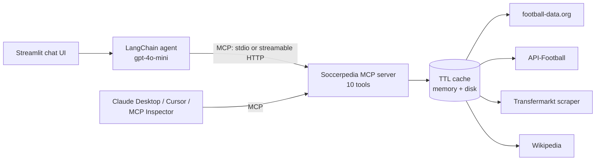

# Soccerpedia

[](https://github.com/RobertRotaru/SoccerPedia/actions/workflows/ci.yml)

A football (soccer) assistant built as an **LLM agent + MCP server**. Ask it about results, fixtures,
standings, player careers or transfers and it answers from live data sources rather than from the
model's memory.

The data layer is a standalone **Model Context Protocol server**, so the same tools work in the
Soccerpedia chat UI, in Claude Desktop, in Cursor, or in any other MCP client.

## Architecture



| Component | Path | What it does |
|---|---|---|
| MCP server | `soccerpedia/mcp_server/football_mcp.py` | Publishes the tool layer over MCP (stdio or streamable HTTP). Tool schemas are generated from the Python signatures and docstrings. |
| Agent | `soccerpedia/agent/agent_factory.py` | LangChain 1.x `create_agent`. Discovers its tools **from the MCP server** through `langchain-mcp-adapters` and never imports them directly. |
| Tools | `soccerpedia/agent/tools.py` | Results, standings, fixtures, live matches, career stats, player comparison, transfers, multi-club careers, free-text search |
| Data sources | `soccerpedia/agent/data_sources.py` | Chooses a source by query type (football-data.org → API-Football → scraping), with per-source rate limiting |
| Cache | `soccerpedia/agent/cache_manager.py` | Two-level (memory + JSON file) TTL cache. The TTL depends on the data: 30 s for live scores, 3–30 min for other match data, 30 min for standings, 6 h for player comparisons. Errors are never cached. |
| UI | `soccerpedia/gui/app.py` | Streamlit chat with multiple saved conversations |

### Design notes

- **Why MCP instead of in-process tools?** It decouples the data layer from the agent. The tools
  can be reused by other clients, tested on their own, and run as a separate service. The agent
  only knows the server's address.
- **Two transports.** stdio needs no setup because the agent spawns the server. Streamable HTTP
  keeps a single long-lived server, which avoids starting a new process for every tool call and
  suits a deployment where the UI and the server run separately.
- **Stdout safety.** With stdio, stdout *is* the JSON-RPC channel, so the server sends any stray
  `print()` from the data sources to stderr.
- **Rate limits.** The free API tiers are small (10 req/min on football-data.org). The cache and
  the per-source limiter keep a normal conversation under that limit.

## Quick start

```bash
git clone https://github.com/RobertRotaru/SoccerPedia.git
cd SoccerPedia/soccerpedia
python -m venv .venv && source .venv/bin/activate   # Windows: .venv\Scripts\activate
pip install -r requirements.txt
cp .env.example .env    # then add your keys
```

| Variable | Required | Where to get it |
|---|---|---|
| `OPENAI_API_KEY` | yes | https://platform.openai.com/api-keys |
| `FOOTBALL_DATA_API_KEY` | yes | free at https://www.football-data.org/client/register |
| `API_FOOTBALL_KEY` | optional | https://www.api-football.com/ |

Run it:

```bash
./run.sh                    # MCP server on :8000 (HTTP) + Streamlit UI
# or just the UI; it spawns the MCP server over stdio:
streamlit run gui/app.py
```

### Use the tools from Claude Desktop (or any MCP client)

```json
{
  "mcpServers": {
    "soccerpedia": {
      "command": "/path/to/SoccerPedia/soccerpedia/.venv/bin/python",
      "args": ["-m", "mcp_server.football_mcp"],
      "cwd": "/path/to/SoccerPedia/soccerpedia"
    }
  }
}
```

Or explore it interactively: `npx @modelcontextprotocol/inspector python -m mcp_server.football_mcp`

## Example questions

- What were the latest La Liga results?
- Show me the current Premier League table.
- Compare Mbappé and Haaland this season.
- Which players have played for both Arsenal and Barcelona?
- Any transfer news on Real Madrid?

League codes: `PL` Premier League · `PD` La Liga · `BL1` Bundesliga · `SA` Serie A · `FL1` Ligue 1 · `CL` Champions League · `EL` Europa League · `WC` World Cup

## Tests

```bash
pip install -r requirements-dev.txt
pytest
```

The suite covers the cache (TTL, persistence, error handling) and the MCP server (tool
registration, generated schemas, calls). It also has an end-to-end test where the agent spawns
the real MCP server over stdio, discovers its tools and runs one. A fake LLM stands in for the
model, so the tests need no API keys and run in CI on every push.

## License

MIT
